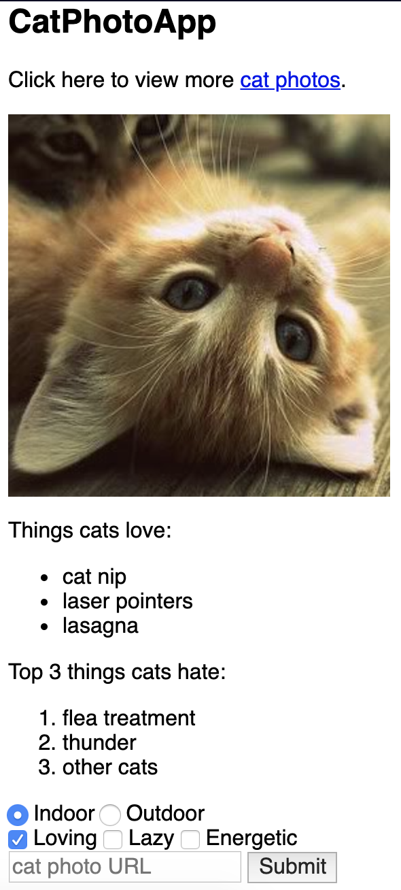
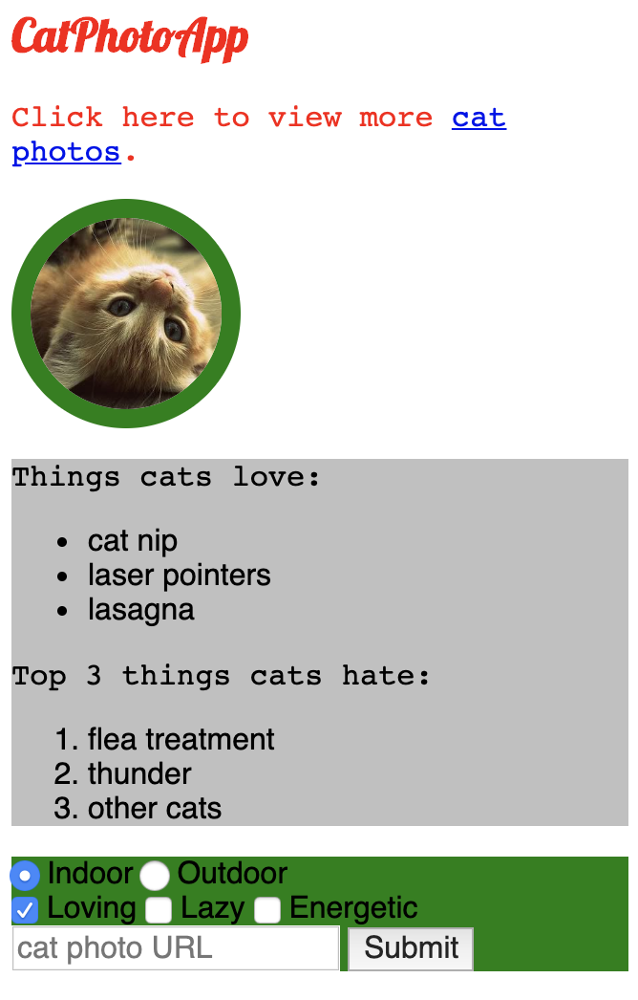

# Basic HTML and CSS


## Basic structure

1. The __\<!DOCTYPE ...\>__ tag shows the version of HTML. For HTML5, you use __\<!DOCTYPE html\>__
The __!__ and uppercase __DOCTYPE__ is important, especially for older browsers. The html is not case sensitive.

Here's an example of a page's layout:

```html
<!DOCTYPE html>
<html>
  <head> </head> (Metadata elements - link, meta, title, style)
  <body> </body> (Content of the page)
</html>
```

2.  HTML5 introduces more descriptive HTML tags (_header_, _footer_, _nav_, _video_, _article_, _section_,  _main_). These tags make your HTML easier to read, and also help with Search Engine Optimization (SEO) and accessibility.

3. The __div__ element is a general purpose container for other elements.

4. The tag for unordered list: __\<ul\>__, ordered list:  __\<ol\>__


## Basic CSS

1. Use __\<style\>...\</style\>__ tag to specify CSS elements.

2. Another (less cleaner) option to add styles (inline method):

```html
<h2 style="color: blue;">CatPhotoApp</h2>
```

3. __.red-text__ is a class (reusable style) selector.

4. __font-family: FAMILY_NAME, GENERIC_NAME;__  
The __GENERIC_NAME__ is a fallback font in case the other specified font is not available.

5. __#cat-photo-form__ is an id selector. It is not reusable and should only be applied to one element. It has a higher specificity (importance) than a class so if both are applied to the same element and have conflicting styles, the styles of the id will be applied.

6. __[attr=value]__ is an attribute selector. This selector matches and styles elements with a specific attribute value.

7. Google Fonts is a free library of web fonts that you can use in your CSS by referencing the font's URL.

## Links


1. __target="\_blank"__ attribute from the anchor tag causes the link to open in a new window tab: 

```html
<a href="#footer" target="_blank">cat photos</a>
```

2. __href="#someid"__ attribute creates an internal link: a hash symbol _#_ plus the value of the id attribute for the element that you want to internally link to. You then need to add the same id attribute to the element you are linking to. An id is an attribute that uniquely describes an element.

Example:

```html
<a href="#contacts-header">Contacts</a>
...
<h2 id="contacts-header">Contacts</h2>
```

3. __href="#"__ attribute creates a dead link


## Images

1. All img elements must have an __alt__ attribute. The text inside an __alt__ attribute is used for screen readers to 
improve accessibility and is displayed if the image fails to load. If the image is purely decorative, using an empty alt attribute is a best practice.

2. Nesting __\__ inside __\<a\>__ can make a link out of an image.


## Forms

1. Placeholder text is displayed by default.

2. By specifying an __action__ on your form element you can submit data to a server (to the URL you specified with your form's action attribute).

3. Some inputs can be made mandatory: 
```html
<input type="text" required>
```

4. Radio buttons - one answer out of multiple options. Each of your radio buttons can be nested within its own __label__ element. By wrapping an input element inside of a label element it will automatically associate the radio button input with the label element surrounding it.

5. A radio button group is created by sharing the same __name__ attribute.

6. It is considered best practice to set a __for__ attribute on the label element, with a value that matches the value of the __id__ attribute of the input element. This allows assistive technologies to create a linked relationship between the label and the child input element.

7. Checkbox buttons - multiple answers out of multiple options.

8. Here, you have two radio inputs. When the user submits the form with the indoor option selected, the form data will include the line: indoor-outdoor=indoor. This is from the __name__ and __value__ attributes of the "indoor" input. If you omit the __value__ attribute, the submitted form data uses the default value, which is on. In this scenario, if the user clicked the "indoor" option and submitted the form, the resulting form data would be indoor-outdoor=on, which is not useful. So the value attribute needs to be set to something to identify the option.

9. You can set a checkbox or radio button to be checked by default using the checked attribute.

```html
<input type="radio" name="test-name" checked>
```


## Sample code

```html

<link href="https://fonts.googleapis.com/css?family=Lobster" rel="stylesheet" type="text/css">
<style>
  .red-text {
    color: red;
  }

  h2 {
    font-family: Lobster, monospace;
  }

  p {
    font-size: 16px;
    font-family: monospace;
  }

  .thick-green-border {
    border-color: green;
    border-width: 10px;
    border-style: solid;
    border-radius: 50%;
  }

  .smaller-image {
    width: 100px;
  }

  .silver-background {
    background-color: silver;
  }

  #cat-photo-form {
    background-color: green;
  }
</style>

<h2 class="red-text">CatPhotoApp</h2>
<main>
  <p class="red-text">Click here to view more <a href="#">cat photos</a>.</p>

  <a href="#"></a>

  <div class="silver-background">
    <p>Things cats love:</p>
    <ul>
      <li>cat nip</li>
      <li>laser pointers</li>
      <li>lasagna</li>
    </ul>
    <p>Top 3 things cats hate:</p>
    <ol>
      <li>flea treatment</li>
      <li>thunder</li>
      <li>other cats</li>
    </ol>
  </div>

  <form action="/submit-cat-photo" id="cat-photo-form">
    <label><input type="radio" name="indoor-outdoor" checked> Indoor</label>
    <label><input type="radio" name="indoor-outdoor"> Outdoor</label><br>
    <label><input type="checkbox" name="personality" checked> Loving</label>
    <label><input type="checkbox" name="personality"> Lazy</label>
    <label><input type="checkbox" name="personality"> Energetic</label><br>
    <input type="text" placeholder="cat photo URL" required>
    <button type="submit">Submit</button>
  </form>
</main>

```


## Result

Without CSS             |  With CSS
:-------------------------:|:-------------------------:
  |   


