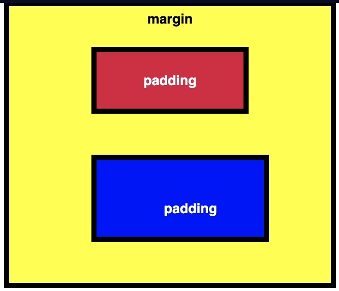

# Padding and margin in CSS

All HTML elements are essentially rectangles. __Padding__, __margin__, and __border__ properties control the space that surrounds each HTML element. 

__Padding__ controls the amount of space between the element's content and its border.
__Margin__ controls the amount of space between an element's border and surrounding elements.

Setting __margin__ to a negative value, will make the element grow larger.

CSS allows you to control the __padding__ of all four individual sides of an element with the _padding-top_, _padding-right_, _padding-bottom_, _and padding-left_ properties (same is true for __margin__). These are the side-specific padding instructions.

Clockwise instructions:
__padding: 10px 20px 10px 20px; (top, right, bottom, left)__

Pixels are a type of length unit, which is what tells the browser how to size or space an item. The two main types of length units are absolute and relative. Absolute units tie to physical units of length. Absolute length units approximate the actual measurement on a screen, but there are some differences depending on a screen's resolution.

Relative units, such as __em__ or __rem__, are relative to another length value. For example, __em__ is based on the size of an element's font. If you use it to set the __font-size__ property itself, it's relative to the parent's __font-size__.


## Sample code

```html
<style>
  .injected-text {
    margin-bottom: -25px;
    text-align: center;
  }

  .box {
    border-style: solid;
    border-color: black;
    border-width: 5px;
    text-align: center;
  }

  .yellow-box {
    background-color: yellow;
    padding: 20px 40px 20px 40px;
  }
  
  .red-box {
    background-color: crimson;
    color: #fff;
    padding: 20px 40px 20px 40px;
    margin: 20px 40px 20px 40px;
  }

  .blue-box {
    background-color: blue;
    color: #fff;
    padding: 40px 20px 20px 40px;
    margin: 40px 20px 20px 40px;
  }
</style>


<h5 class="injected-text">margin</h5>

<div class="box yellow-box">
  <h5 class="box red-box">padding</h5>
  <h5 class="box blue-box">padding</h5>
</div>
```

## Result

 