# Visual design (part 2)


## Pseudo-class

A pseudo-class is a keyword that can be added to selectors, in order to select a specific state of the element. For example, the styling of an anchor tag can be changed for its hover state using the __:hover pseudo-class__ selector. Here's the CSS to change the color of the anchor tag during its hover state:

```html
<style>
  a {
    color: #000;
  }
  
  a:hover {
  color: blue;
}

</style>

<a href="http://freecatphotoapp.com/" target="_blank">CatPhotoApp</a>
```

## Positioning

1. CSS treats each HTML element as its own box, which is usually referred to as the CSS Box Model. Block-level items automatically start on a new line (think headings, paragraphs, and divs) while inline items sit within surrounding content (like images or spans). The default layout of elements in this way is called the normal flow of a document, but CSS offers the __position__ property to override it.

2. When the position of an element is set to relative, it allows you to specify how CSS should move it relative to its current position in the normal flow of the page. It pairs with the CSS offset properties of left or right, and top or bottom. These say how many pixels, percentages, or ems to move the item away from where it is normally positioned. The following example moves the paragraph 10 pixels away from the bottom:

```html
p {
  position: relative;
  bottom: 10px;
}
```

Changing an element's position to relative does not remove it from the normal flow - other elements around it still behave as if that item were in its default position.

```html
<head>
<style>
  h2 {
    position: relative;
    left: 15px;
    bottom: 10px;
    
  }
</style>
</head>
<body>
  <h1>On Being Well-Positioned</h1>
  <h2>Move me!</h2>
  <p>I still think the h2 is where it normally sits.</p>
</body>
```

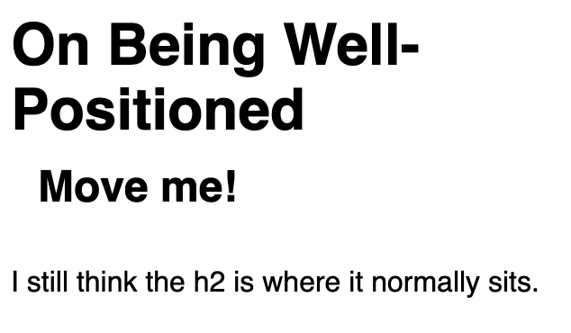

3. Positioning gives you a lot of flexibility and power over the visual layout of a page. It's good to remember that no matter the position of elements, the underlying HTML markup should be organized and make sense when read from top to bottom. This is how users with visual impairments (who rely on assistive devices like screen readers) access your content.


4. The next option for the CSS position property is absolute, which locks the element in place relative to its parent container. Unlike the relative position, this removes the element from the normal flow of the document, so surrounding items ignore it. The CSS __offset__ properties (top or bottom and left or right) are used to adjust the position.

One nuance with absolute positioning is that it will be locked relative to its closest positioned ancestor. If you forget to add a position rule to the parent item, (this is typically done using __position: relative;__), the browser will keep looking up the chain and ultimately default to the body tag.

```html
<style>
  #searchbar {   
    position: absolute;
    top: 50px;
    right: 50px;
    
  }
  section {
    position: relative;
  }
</style>

<body>
  <h1>Welcome!</h1>
  <section>
    <form id="searchbar">
      <label for="search">Search:</label>
      <input type="search" id="search" name="search">
      <input type="submit" name="submit" value="Go!">
    </form>
  </section>
</body>
```

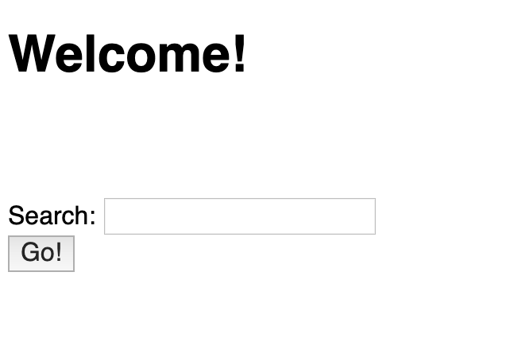

5. The next layout scheme that CSS offers is the fixed position, which is a type of absolute positioning that locks an element relative to the browser window. Similar to absolute positioning, it's used with the CSS offset properties and also removes the element from the normal flow of the document. Other items no longer "realize" where it is positioned, which may require some layout adjustments elsewhere.

One key difference between the fixed and absolute positions is that an element with a fixed position won't move when the user scrolls.

```html
<style>
  #navbar {
    position: fixed;
    top: 0px;
    left: 0px;
    width: 100%;
    background-color: #767676;
  }
  nav ul {
    margin: 0px;
    padding: 5px 0px 5px 30px;
  }
  nav li {
    display: inline;
    margin-right: 20px;
  }
  a {
    text-decoration: none;
  }
</style>

<body>
  <header>
    <h1>Welcome!</h1>
    <nav id="navbar">
      <ul>
        <li><a href="">Home</a></li>
        <li><a href="">Contact</a></li>
      </ul>
    </nav>
  </header>
  <p>I shift up when the #navbar is fixed to the browser window.</p>
</body>
```

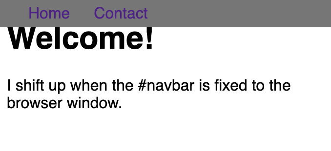


6. The next positioning tool does not actually use position, but sets the __float__ property of an element. Floating elements are removed from the normal flow of a document and pushed to either the left or right of their containing parent element. It's commonly used with the __width__ property to specify how much horizontal space the floated element requires.

```html
<head>
  <style>
  #left {
    float: left;
    width: 50%;
  }
  #right {
    float: right;
    width: 40%;
  }
  aside, section {
    padding: 2px;
    background-color: #ccc;
  }
  </style>
</head>
<body>
  <header>
    <h1>Welcome!</h1>
  </header>
  <section id="left">
    <h2>Content</h2>
    <p>Good stuff</p>
  </section>
  <aside id="right">
    <h2>Sidebar</h2>
    <p>Links</p>
  </aside>
</body>
```

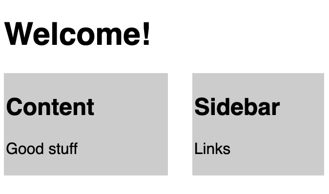


7. When elements are positioned to overlap, the element coming later in the HTML markup will, by default, appear on the top of the other elements. However, the __z-index__ property can specify the order of how elements are stacked on top of one another. It must be an integer (i.e. a whole number and not a decimal), and higher values for the __z-index__ property of an element move it higher in the stack than those with lower values.

```html
<style>
  div {
    width: 60%;
    height: 200px;
    margin-top: 20px;
  }
  
  .first {
    background-color: red;
    position: absolute;
    z-index: 2;
  }
  .second {
    background-color: blue;
    position: absolute;
    left: 40px;
    top: 50px;
    z-index: 1;
  }
</style>

<div class="first"></div>
<div class="second"></div>
```

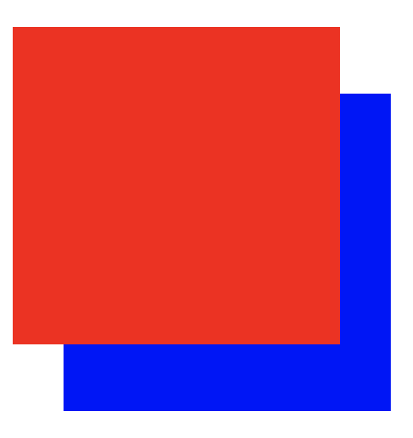


8. Another positioning technique is to center a block element horizontally. One way to do this is to set its margin to a value of auto. This method works for images, too. Images are inline elements by default, but can be changed to block elements when you set the display property to block.

```html
<style>
  div {
    background-color: blue;
    height: 100px;
    width: 100px;
    margin: auto;
  }
</style>
<div></div>
```

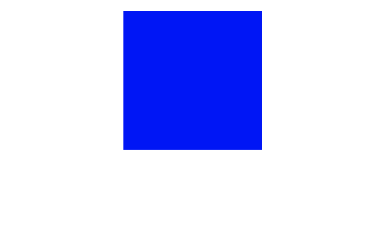


## Color

1. CSS provides the ability to use color transitions, otherwise known as gradients, on elements. This is accessed through the background property's __linear-gradient()__ function. Here is the general syntax:

_background: linear-gradient(gradient_direction, color 1, color 2, color 3, ...);_

The first argument specifies the direction from which color transition starts - it can be stated as a degree, where 90deg makes a vertical gradient and 45deg is angled like a backslash. The following arguments specify the order of colors used in the gradient.

```html
<style>

  div{ 
    border-radius: 20px;
    width: 70%;
    height: 400px;
    margin: 50px auto;
    background: linear-gradient(35deg, #CCFFFF, #FFCCCC);
  }

</style>

<div></div>
```

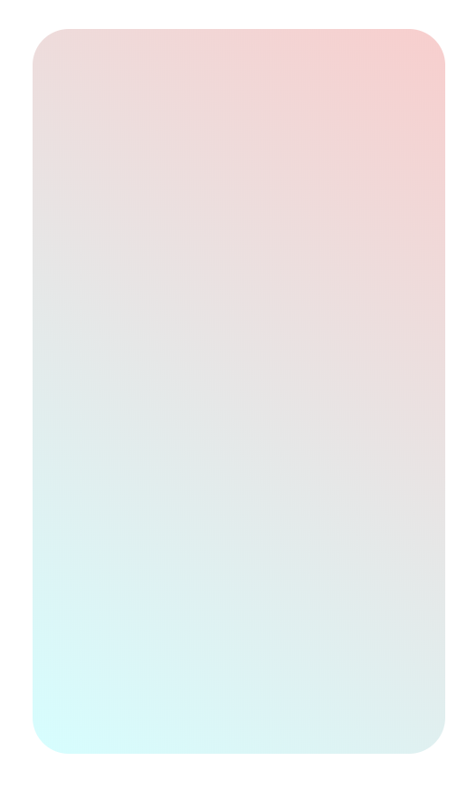


2. The __repeating-linear-gradient()__ function is very similar to __ linear-gradient()__  with the major difference that it repeats the specified gradient pattern. __ repeating-linear-gradient()__  accepts a variety of values. The angle value is the direction of the gradient. Color stops are like width values that mark where a transition takes place, and are given with a percentage or a number of pixels.

In the example the gradient starts with the color yellow at 0 pixels which blends into the second color blue at 40 pixels away from the start. Since the next color stop is also at 40 pixels, the gradient immediately changes to the third color green, which itself blends into the fourth color value red as that is 80 pixels away from the beginning of the gradient.

For this example, it helps to think about the color stops as pairs where every two colors blend together.

_0px [yellow -- blend -- blue] 40px [green -- blend -- red] 80px_

If every two color stop values are the same color, the blending isn't noticeable because it's between the same color, followed by a hard transition to the next color, so you end up with stripes. 


```html
<style>

  div{ 
    border-radius: 20px;
    width: 70%;
    height: 400px;
    margin:  50 auto;
    background: repeating-linear-gradient(
      45deg,
      yellow 0px,
      yellow 40px,
      black 40px,
      black 80px
    );
  }

</style>

<div></div>
```

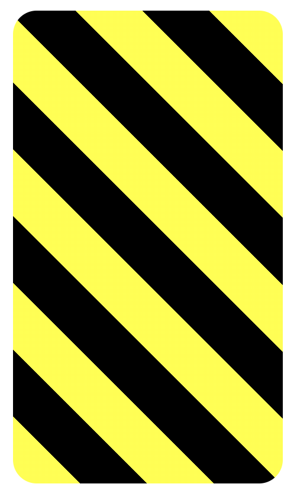


3. One way to add texture and interest to a background and have it stand out more is to add a subtle pattern. The key is balance, as you don't want the background to stand out too much, and take away from the foreground. The background property supports the __url()__ function in order to link to an image of the chosen texture or pattern. The link address is wrapped in quotes inside the parentheses.

```html
<style>
  body {
    background: url(https://i.imgur.com/MJAkxbh.png)
  }
</style>
```

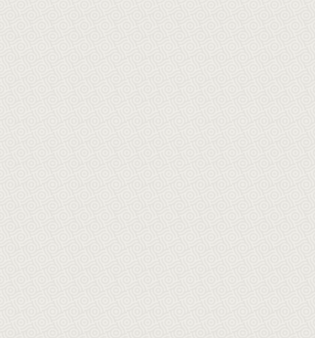


## Transformations


1. To change the scale of an element, CSS has the __transform__ property, along with its __scale()__ function. The following code example doubles the size of _#ball2_ on the page:


```html
<style>
  .ball { 
    width: 40px;
    height: 40px;
    margin: 50 auto;
    position: fixed;
    background: linear-gradient(
      35deg,
      #ccffff,
      #ffcccc
    );
    border-radius: 50%;
  }
  #ball1 {
    left: 20%;
  }
  #ball2 {
    left: 65%;
    transform:scale(2);
  }


</style>

<div class="ball" id= "ball1"></div>
<div class="ball" id= "ball2"></div>
```

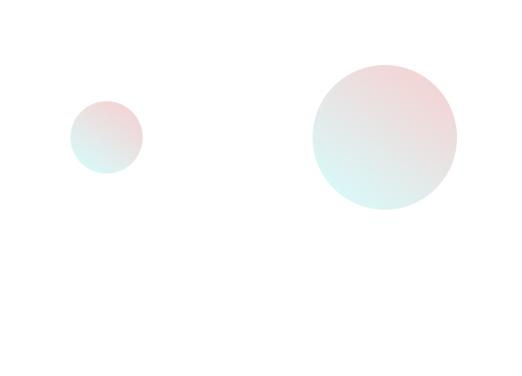


2. The __transform__ property has a variety of functions that lets you scale, move, rotate, skew, etc., your elements. When used with pseudo-classes such as __:hover__ that specify a certain state of an element, the transform property can easily add interactivity to your elements.

Here's an example to scale the div elements to 1.1 times their original size when a user hovers over them:


```html
<style>
  div { 
    width: 70%;
    height: 100px;
    margin:  50px auto;
    background: linear-gradient(
      53deg,
      #ccfffc,
      #ffcccf
    );
  }

  div:hover {
  transform: scale(1.1);
}
  
</style>

<div></div>
```


3. The next function of the transform property is __skewX()__, which skews the selected element along its X (horizontal) axis by a given degree.

Given that the __skewX()__ function skews the selected element along the X-axis by a given degree, it is no surprise that the __skewY()__ property skews an element along the Y (vertical) axis.


```html
<style>
  div { 
    width: 70%;
    height: 100px;
    margin:  50px auto;
  }
  #top {
    background-color: red;
    transform: skewY(-10deg);
  }
  #bottom {
    background-color: blue;
    transform: skewX(24deg);
  }
</style>

<div id="top"></div>
<div id="bottom"></div>
```

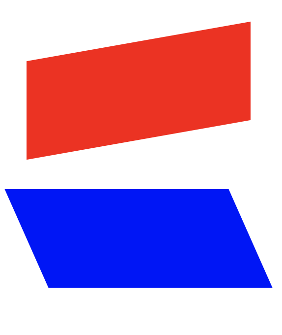


4. By manipulating different selectors and properties, you can make interesting shapes. One of the easier ones to try is a crescent moon shape. You need to work with the __box-shadow__ property that sets the shadow of an element, along with the __border-radius__ property that controls the roundness of the element's corners. You will create a round, transparent object with a crisp shadow that is slightly offset to the side - the shadow is actually going to be the moon shape you see.

In order to create a round object, the __border-radius__ property should be set to a value of 50%.

The __box-shadow__ property takes values for _offset-x_, _offset-y_, _blur-radius_, _spread-radius_ and a _color_ value in that order. The _blur-radius_ and _spread-radius_ values are optional.


```html
<style>
.center
{
  position: absolute;
  margin: auto;
  top: 0;
  right: 0;
  bottom: 0;
  left: 0;
  width: 100px;
  height: 100px;
  
  background-color: transparent;
  border-radius: 50%;
  box-shadow: 25px 10px 0 0 blue; 
}

</style>
<div class="center"></div>
```

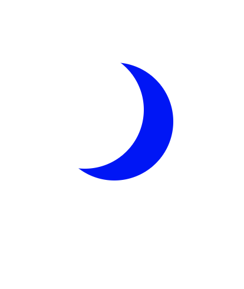


5. One of the most popular shapes in the world is the heart shape. First you need to understand the __::before__ and __::after__ pseudo-elements. These pseudo-elements are used to add something before or after a selected element. In the following example, a __::before__ pseudo-element is used to add a rectangle to an element with the class heart:

```html
.heart::before {
  content: "";
  background-color: yellow;
  border-radius: 25%;
  position: absolute;
  height: 50px;
  width: 70px;
  top: -50px;
  left: 5px;
}
```

For the __::before__ and __::after__ pseudo-elements to function properly, they must have a defined __content__ property. This property is usually used to add things like a photo or text to the selected element. When the __::before__ and __::after__ pseudo-elements are used to make shapes, the content property is still required, but it's set to an empty string.

In the above example, the element with the class of heart has a __::before__ pseudo-element that produces a yellow rectangle with height and width of 50px and 70px, respectively. This rectangle has round corners due to its 25% border radius and is positioned absolutely at 5px from the left and 50px above the top of the element.


```html
<style>
.heart {
  position: absolute;
  margin: auto;
  top: 0;
  right: 0;
  bottom: 0;
  left: 0;
  background-color: pink;
  height: 50px;
  width: 50px;
  transform: rotate(-45deg);
}
.heart::after {
  background-color: pink;
  content: "";
  border-radius: 50%;
  position: absolute;
  width: 50px;
  height: 50px;
  top: 0px;
  left: 25px;
}
.heart::before {
  content: "";
  background-color: pink;
  border-radius: 50%;
  position: absolute;
  width: 50px;
  height: 50px;
  top: -25px;
  left: 0px;
}
</style>
<div class = "heart"></div>
```

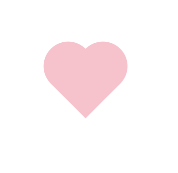


6. To animate an element, you need to know about the __animation__ properties and the __@keyframes__ rule. The __animation__ properties control how the animation should behave and the __@keyframes__ rule controls what happens during that animation. There are eight animation properties in total. The two most important ones first:

__animation-name__ sets the name of the animation, which is later used by __@keyframes__ to tell CSS which rules go with which animations.

__animation-duration__ sets the length of time for the animation.

__@keyframes__ is how to specify exactly what happens within the animation over the duration. This is done by giving CSS properties for specific "frames" during the animation, with percentages ranging from 0% to 100%. If you compare this to a movie, the CSS properties for 0% is how the element displays in the opening scene. The CSS properties for 100% is how the element appears at the end, right before the credits roll. Then CSS applies the magic to transition the element over the given duration to act out the scene. Here's an example to illustrate the usage of __@keyframes__ and the animation properties:


```html

#anim {
  animation-name: colorful;
  animation-duration: 3s;
}
@keyframes colorful {
  0% {
    background-color: blue;
  }
  100% {
    background-color: yellow;
  }
}
```

For the element with the _anim_ id, the code snippet above sets the __animation-name__ to _colorful_ and sets the __animation-duration__ to 3 seconds. Then the __@keyframes__ rule links to the animation properties with the name colorful. It sets the color to blue at the beginning of the animation (0%) which will transition to yellow by the end of the animation (100%). You aren't limited to only beginning-end transitions, you can set properties for the element for any percentage between 0% and 100%.


```html
<style>
  div {
    height: 40px;
    width: 70%;
    background: black;
    margin: 50px auto;
    border-radius: 5px;
  }

  #rect {
    animation-name: rainbow;
    animation-duration: 4s;   
  }

  @keyframes rainbow {
    0% {
      background-color: blue;
    }
    50% {
      background-color: green;
    }
    100% {
      background-color: yellow;
    }
  }
   
</style>
<div id="rect"></div>
```

7. You can use CSS __@keyframes__ to change the color of a button in its _hover_ state. Here's an example of it:

```html
<style>
  button {
    border-radius: 5px;
    color: white;
    background-color: #0F5897;
    padding: 5px 10px 8px 10px;
  }

  button:hover {
    animation-name: background-color;
    animation-duration: 500ms;
  }

  @keyframes background-color {
    100% {
      background-color: #4791d0;
    }
  }

</style>

<button>Register</button>
```

That's great, but right now the animation resets after 500ms has passed, causing the button to revert back to the original color. You want the button to stay highlighted. This can be done by setting the __animation-fill-mode__ property to forwards. The __animation-fill-mode__ specifies the style applied to an element when the animation has finished. You can set it like so:

__animation-fill-mode: forwards;__


```html
<style>
  button {
    border-radius: 5px;
    color: white;
    background-color: #0F5897;
    padding: 5px 10px 8px 10px;
  }
  
  button:hover {
    animation-name: background-color;
    animation-duration: 500ms;
    animation-fill-mode: forwards;
  }

  @keyframes background-color {
    100% {
      background-color: #4791d0;
    }
  }
  
  
</style>
  
<button>Register</button>
```

8. When elements have a specified position, such as fixed or relative, the CSS __offset__ properties right, left, top, and bottom can be used in animation rules to create movement. As shown in the example below, you can push the item downwards then upwards by setting the top property of the 50% keyframe to 50px, but having it set to 0px for the first (0%) and the last (100%) keyframe.

```html
@keyframes rainbow {
  0% {
    background-color: blue;
    top: 0px;
  }
  50% {
    background-color: green;
    top: 50px;
  }
  100% {
    background-color: yellow;
    top: 0px;
  }
} 
```

9. Another animation property is the __animation-iteration-count__, which allows you to control how many times you would like to loop through the animation. Here's an example:

__animation-iteration-count: infinite;__


In CSS animations, the __animation-timing-function__ property controls how quickly an animated element changes over the duration of the animation. If the animation is a car moving from point A to point B in a given time (your __animation-duration__), the __animation-timing-function__ says how the car accelerates and decelerates over the course of the drive.

There are a number of predefined keywords available for popular options. For example, the default value is _ease_, which starts slow, speeds up in the middle, and then slows down again in the end. Other options include _ease-out_, which is quick in the beginning then slows down, _ease-in_, which is slow in the beginning, then speeds up at the end, or _linear_, which applies a constant animation speed throughout.


```html
<style>

  .balls {
    border-radius: 50%;
    background: linear-gradient(
      35deg,
      #ccffff,
      #ffcccc
    );
    position: fixed;  
    width: 50px;
    height: 50px;
    margin-top: 50px;
    animation-name: bounce;
    animation-duration: 2s;
    animation-iteration-count: infinite;
  }
  #ball1 { 
    left:27%;
    animation-timing-function: linear;
  }
  #ball2 { 
    left:56%;
    animation-timing-function: ease-out;
  }

@keyframes bounce {
  0% {
    top: 0px;
  } 
  100% {
    top: 249px;
  }
} 

</style>

<div class="balls" id="ball1"></div>
<div class="balls" id="ball2"></div>
```

10. CSS offers an option other than keywords that provides even finer control over how the animation plays out, through the use of __Bezier curves__. In CSS animations, Bezier curves are used with the cubic-bezier function. The shape of the curve represents how the animation plays out. The curve lives on a 1 by 1 coordinate system. The X-axis of this coordinate system is the duration of the animation (think of it as a time scale), and the Y-axis is the change in the animation.

The cubic-bezier function consists of four main points that sit on this 1 by 1 grid: p0, p1, p2, and p3. p0 and p3 are set for you - they are the beginning and end points which are always located respectively at the origin (0, 0) and (1, 1). You set the x and y values for the other two points, and where you place them in the grid dictates the shape of the curve for the animation to follow. This is done in CSS by declaring the x and y values of the p1 and p2 "anchor" points in the form: (x1, y1, x2, y2). Pulling it all together, here's an example of a Bezier curve in CSS code:

__animation-timing-function: cubic-bezier(0.25, 0.25, 0.75, 0.75);__

In the example above, the x and y values are equivalent for each point (x1 = 0.25 = y1 and x2 = 0.75 = y2), which if you remember from geometry class, results in a line that extends from the origin to point (1, 1). This animation is a linear change of an element during the length of an animation, and is the same as using the linear keyword. In other words, it changes at a constant speed.
